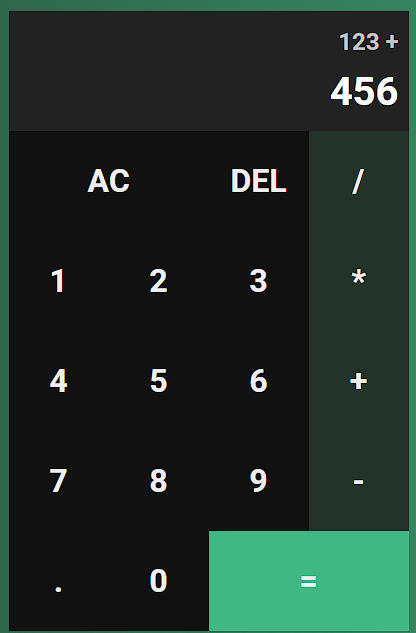

# 🧮 Calculadora

Uma calculadora simples e funcional desenvolvida com **HTML**, **CSS** e **JavaScript**. Ideal para praticar conceitos fundamentais de desenvolvimento web e lógica de programação.

---

## ✨ Funcionalidades

- ➕ Adição  
- ➖ Subtração  
- ✖️ Multiplicação  
- ➗ Divisão  
- 🧹 Limpar entrada (AC)  
- ⌫ Apagar último dígito (DEL)  
- 🔘 Suporte a ponto decimal  
- 🔄 Atualização dinâmica do visor  

---

## 🛠️ Tecnologias Utilizadas

| Tecnologia | Finalidade |
|------------|------------|
| HTML5      | Estrutura da interface |
| CSS3       | Estilização e layout responsivo |
| JavaScript | Lógica de funcionamento e manipulação de eventos |

---

## 🚀 Como Executar

1. Clone o repositório
2. Abra o Arquivo Index.html
3. Use os botões da interface para realizar cálculos

## 🛠️ Melhorias Futuras

- Teclado físico integrado
- Histórico de cálculos
- Suporte a teclas avançadas (porcentagem, raiz quadrada, etc.)
- Tema claro/escuro

  

